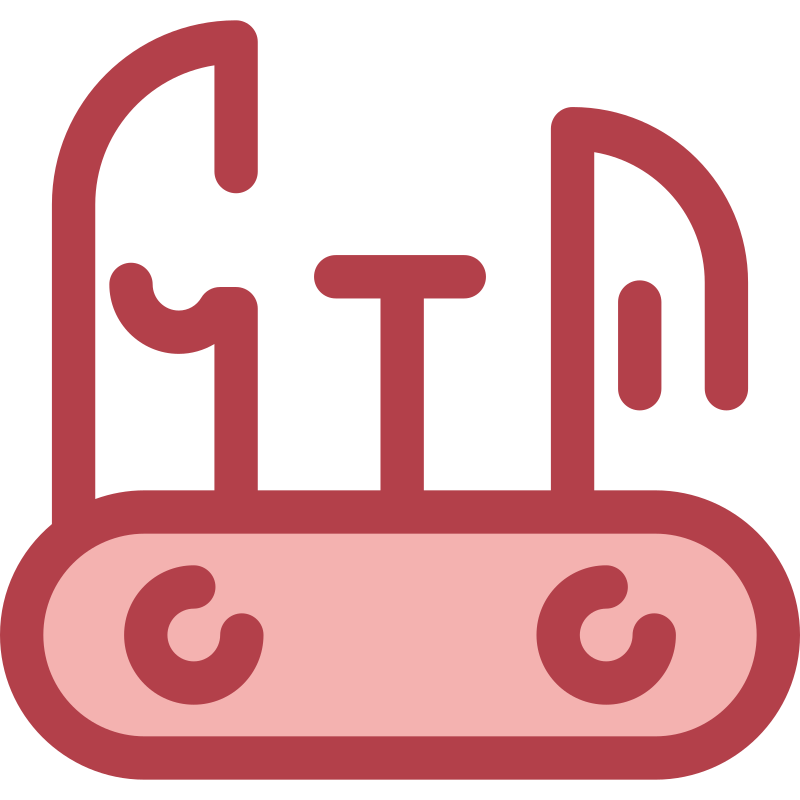

<a name="readme-top"></a>

<!-- PROJECT SHIELDS -->
<!--
*** I'm using markdown "reference style" links for readability.
*** Reference links are enclosed in brackets [ ] instead of parentheses ( ).
*** See the bottom of this document for the declaration of the reference variables
*** for contributors-url, forks-url, etc. This is an optional, concise syntax you may use.
*** https://www.markdownguide.org/basic-syntax/#reference-style-links
-->
[![Contributors][contributors-shield]][contributors-url]
[![Forks][forks-shield]][forks-url]
[![Stargazers][stars-shield]][stars-url]
[![Issues][issues-shield]][issues-url]
[![MIT License][license-shield]][license-url]

<!-- PROJECT LOGO -->
<br />
<div align="center">
  <a href="https://github.com/csm-kb/swiss-rtsp">
    
  </a>

  <h3 align="center"><code>swiss-rtsp</code></h3>

  <p align="center">
    A containerized streaming pipeline for ingesting various stream types and exposing them as an RTSP stream.
    <br />
    <a href="https://github.com/csm-kb/swiss-rtsp"><strong>Explore the docs »</strong></a>
    <br />
    <br />
    <a href="https://github.com/csm-kb/swiss-rtsp">View Demo</a>
    ·
    <a href="https://github.com/csm-kb/swiss-rtsp/issues">Report Bug</a>
    ·
    <a href="https://github.com/csm-kb/swiss-rtsp/issues">Request Feature</a>
  </p>
</div>


<!-- TABLE OF CONTENTS -->
<details>
  <summary>Table of Contents</summary>
  <ol>
    <li>
      <a href="#about-the-project">About The Project</a>
      <ul>
        <li><a href="#built-with">Built With</a></li>
      </ul>
    </li>
    <li>
      <a href="#getting-started">Getting Started</a>
      <ul>
        <li><a href="#prerequisites">Prerequisites</a></li>
        <li><a href="#installation">Installation</a></li>
      </ul>
    </li>
    <li><a href="#usage">Usage</a></li>
    <li><a href="#roadmap">Roadmap</a></li>
    <li><a href="#contributing">Contributing</a></li>
    <li><a href="#license">License</a></li>
    <li><a href="#contact">Contact</a></li>
    <li><a href="#acknowledgments">Acknowledgments</a></li>
  </ol>
</details>


<!-- ABOUT THE PROJECT -->
## About The Project

:construction: Work in progress.

<p align="right">(<a href="#readme-top">back to top</a>)</p>


### Built With

:construction: Work in progress.

* [![FFmpeg][FFmpeg]][FFmpeg-url]
* [![Node][Node.js]][Node-url]

<p align="right">(<a href="#readme-top">back to top</a>)</p>


<!-- GETTING STARTED -->
## Getting Started

### Prerequisites

* npm
  ```sh
  npm install -g npm
  ```
  See [this link](https://docs.npmjs.com/downloading-and-installing-node-js-and-npm) for more info.

### Installation

1. Clone the repo
   ```sh
   git clone https://github.com/csm-kb/swiss-rtsp.git
   ```
2. Install NPM packages
   ```sh
   npm i
   ```
3. ???
4. Profit

<p align="right">(<a href="#readme-top">back to top</a>)</p>


<!-- USAGE EXAMPLES -->
## Usage

:construction: Work in progress.

_For more examples, please refer to the [Documentation](https://example.com)_

<p align="right">(<a href="#readme-top">back to top</a>)</p>


<!-- ROADMAP -->
## Roadmap

- [ ] MVP with `docker-compose.yml` for local development

See the [open issues](https://github.com/csm-kb/swiss-rtsp/issues) for a full list of proposed features (and known issues).

<p align="right">(<a href="#readme-top">back to top</a>)</p>


<!-- CONTRIBUTING -->
## Contributing

Contributions are what make the open source community such an amazing place to learn, inspire, and create. Any contributions you make are **greatly appreciated**.

If you have a suggestion that would make this better, please fork the repo and create a pull request. You can also simply open an issue with the tag "enhancement".
Don't forget to give the project a star!

1. Fork the Project
2. Create your Feature Branch (`git checkout -b feature/AmazingFeature`)
3. Commit your Changes (`git commit -m 'Add some AmazingFeature'`)
4. Push to the Branch (`git push origin feature/AmazingFeature`)
5. Open a Pull Request

<p align="right">(<a href="#readme-top">back to top</a>)</p>


<!-- LICENSE -->
## License

Distributed under the MIT License. See `LICENSE.txt` for more information.

<p align="right">(<a href="#readme-top">back to top</a>)</p>


<!-- ACKNOWLEDGMENTS -->
## Acknowledgments

:construction: Work in progress.

* [Choose an Open Source License](https://choosealicense.com)
* [GitHub Emoji Cheat Sheet](https://www.webpagefx.com/tools/emoji-cheat-sheet)
* [Malven's Flexbox Cheatsheet](https://flexbox.malven.co/)
* [Malven's Grid Cheatsheet](https://grid.malven.co/)
* [Img Shields](https://shields.io)
* [GitHub Pages](https://pages.github.com)
* [Font Awesome](https://fontawesome.com)
* [React Icons](https://react-icons.github.io/react-icons/search)

<p align="right">(<a href="#readme-top">back to top</a>)</p>


<!-- MARKDOWN LINKS & IMAGES -->
<!-- https://www.markdownguide.org/basic-syntax/#reference-style-links -->
[contributors-shield]: https://img.shields.io/github/contributors/csm-kb/swiss-rtsp.svg?style=for-the-badge
[contributors-url]: https://github.com/csm-kb/swiss-rtsp/graphs/contributors
[forks-shield]: https://img.shields.io/github/forks/csm-kb/swiss-rtsp.svg?style=for-the-badge
[forks-url]: https://github.com/csm-kb/swiss-rtsp/network/members
[stars-shield]: https://img.shields.io/github/stars/csm-kb/swiss-rtsp.svg?style=for-the-badge
[stars-url]: https://github.com/csm-kb/swiss-rtsp/stargazers
[issues-shield]: https://img.shields.io/github/issues/csm-kb/swiss-rtsp.svg?style=for-the-badge
[issues-url]: https://github.com/csm-kb/swiss-rtsp/issues
[license-shield]: https://img.shields.io/github/license/csm-kb/swiss-rtsp.svg?style=for-the-badge
[license-url]: https://github.com/csm-kb/swiss-rtsp/blob/master/LICENSE.txt
[FFmpeg]: https://img.shields.io/badge/FFmpeg-007808?style=for-the-badge&logo=ffmpeg&logoColor=white
[FFmpeg-url]: https://ffmpeg.org/
[Node.js]: https://img.shields.io/badge/Node.js-339933?style=for-the-badge&logo=nodedotjs&logoColor=white
[Node-url]: https://nodejs.org/
